<picture>
  <source media="(prefers-color-scheme: dark)" srcset="docs/assets/banner-dark.svg">
  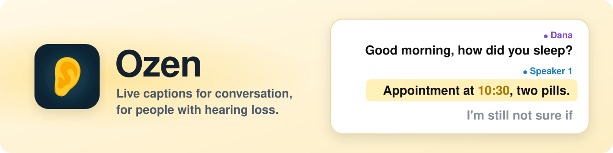
</picture>

<p align="center"><strong>On the phone, private, and built to be read all evening.</strong></p>

<p align="center">
  <a href="https://github.com/arbelonson-source/ozen/actions/workflows/ci.yml"></a>
  <a href="https://github.com/arbelonson-source/ozen/releases/latest"></a>
  <a href="LICENSE"></a>
  
</p>
<p align="center">
  
  
  
  
  
  
  <a href="#training-a-model-that-hears-across-the-room"></a>
</p>

Ozen (the word means "ear") turns what the people around you say into
large, steady captions on your phone, as they speak. It was built for one
grandmother with hearing loss, who found every existing transcription app
either unreliable with external microphones or too shallow to trust.

<p align="center">
  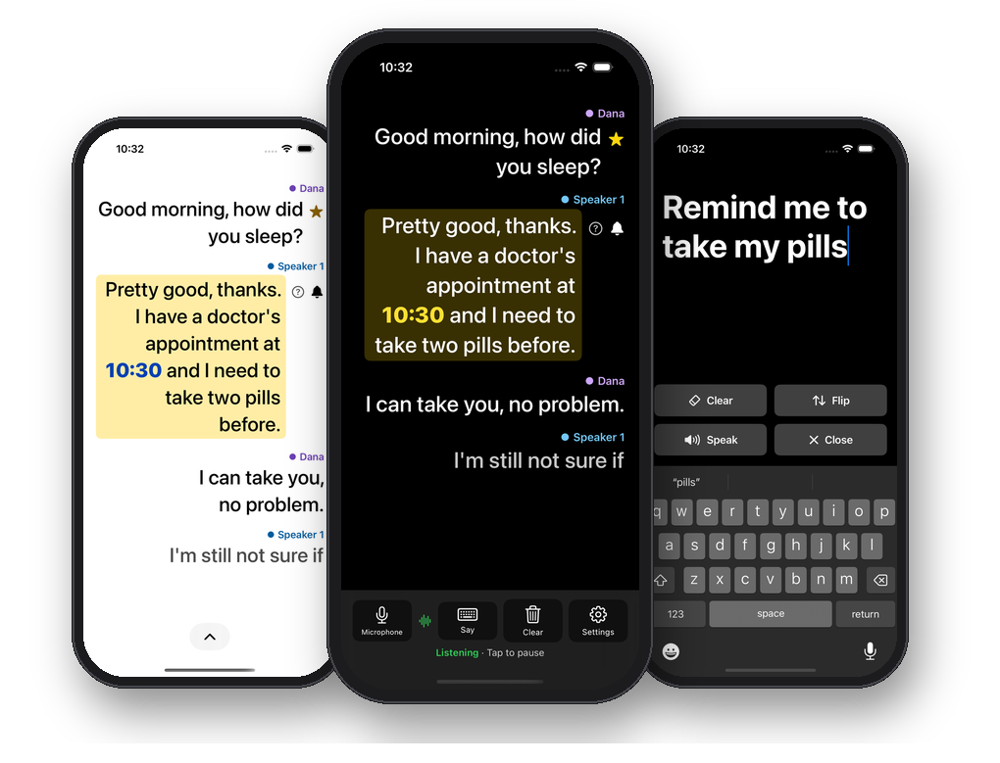
</p>

- **Captions that hold still.** Words settle in place instead of jumping
  around, and a name shows who is talking.
- **Private by design.** No account and no company server: nothing leaves
  the phone unless you choose to send it.
- **Alerts she won't miss.** The doorbell, a smoke alarm or her own name
  makes the phone buzz, even in a pocket; alarms flash the whole screen.
- **Talk back.** Type a reply and the phone says it out loud, or shows it
  in huge letters.
- **Faster with a home computer.** Optionally, a PC with a graphics card
  writes the captions, faster and more accurately than the phone.

## How it works

<picture>
  <source media="(prefers-color-scheme: dark)" srcset="docs/assets/how-it-works-dark.svg">
  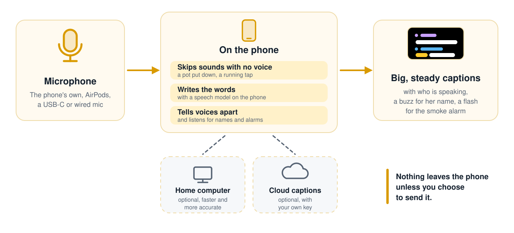
</picture>

## Gallery

<table>
  <tr>
    <td align="center" width="33%">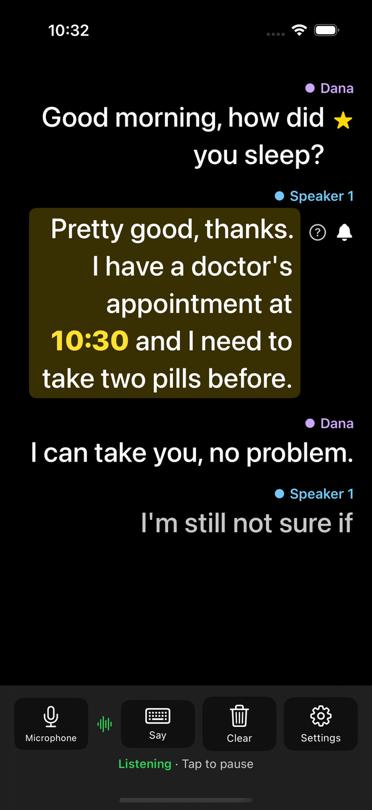<br><sub>Live captions, with who said each line. A phrase she asked to hear about lights up.</sub></td>
    <td align="center" width="33%">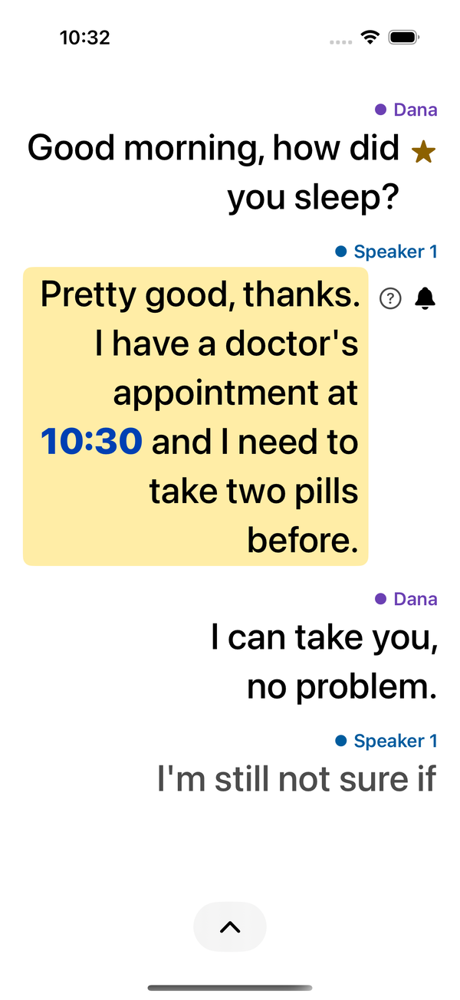<br><sub>A light theme for daytime reading.</sub></td>
    <td align="center" width="33%">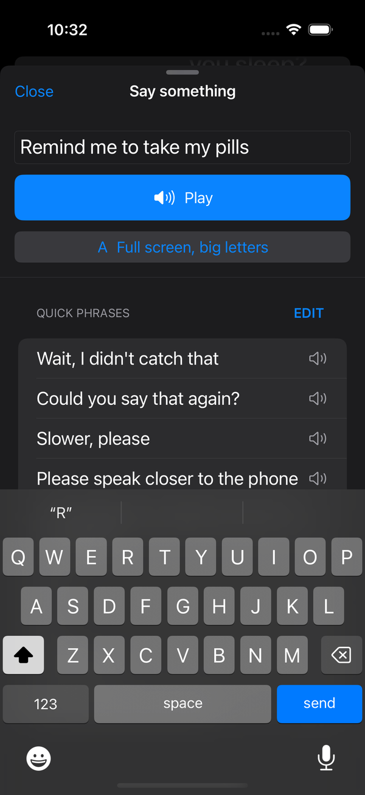<br><sub>Type a reply and the phone says it aloud. Common phrases are one tap away.</sub></td>
  </tr>
  <tr>
    <td align="center">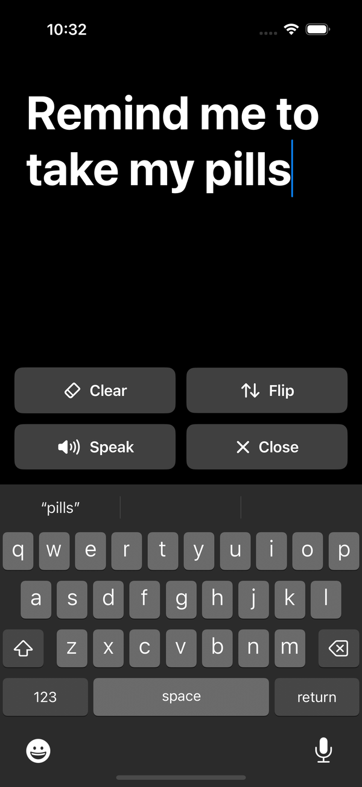<br><sub>Or show it full screen, in letters anyone across the table can read.</sub></td>
    <td align="center">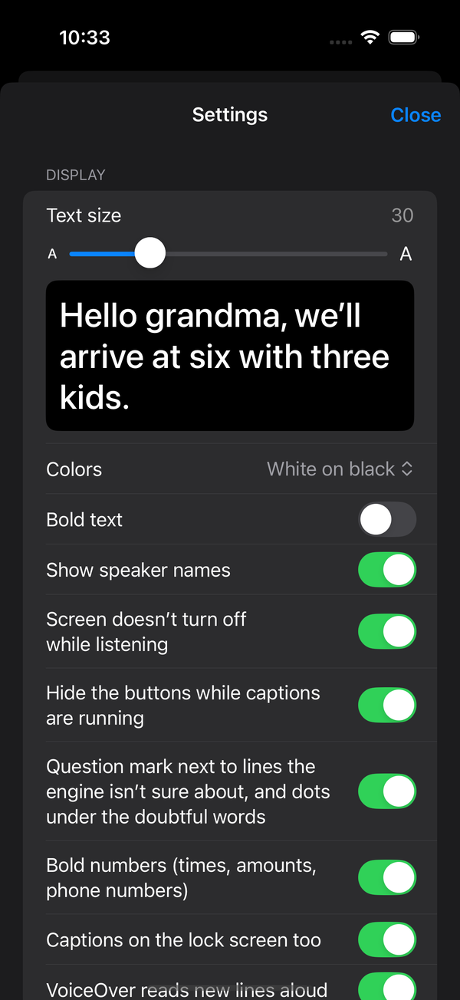<br><sub>Settings in plain words, with a live preview of the text size.</sub></td>
    <td align="center">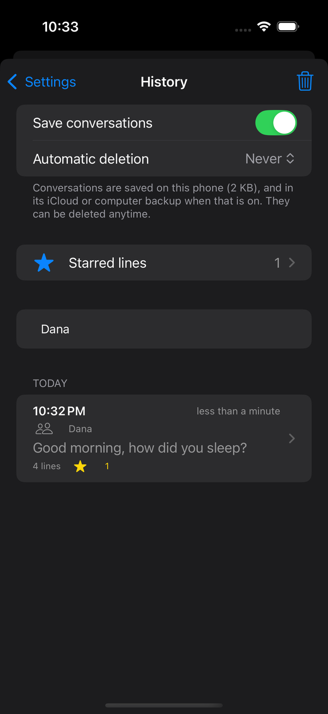<br><sub>Past conversations are saved on the phone, and can be deleted any time.</sub></td>
  </tr>
</table>

<sub>Shown in English, the sample conversation too, so it reads here. Ozen
captions Hebrew speech; the interface comes in twelve languages.</sub>

## Why this exists

Existing apps (evaluated: Nagish) had three concrete problems: inconsistent
handling of external microphones (no explicit input picker, a USB-C
lavalier mic didn't work at all, AirPods worked but not reliably), live
transcription treated as a minor feature rather than the point of the app,
and no real speaker detection. Ozen exists to fix specifically those three
things, for Hebrew conversation, entirely on-device.

## What it does

<table>
  <tr>
    <td width="33%" valign="top"><br><b>Live, steady captions</b><br>Words appear as they're said and settle in place once they're stable.</td>
    <td width="33%" valign="top"><br><b>Made for reading all evening</b><br>Text from 20 to 64 pt, three colour schemes, and numbers that stand out.</td>
    <td width="33%" valign="top"><br><b>Who said what</b><br>Voices are told apart on the phone, and named once you record them.</td>
  </tr>
  <tr>
    <td width="33%" valign="top"><br><b>Any microphone</b><br>The phone's own, Bluetooth, wired or USB-C, picked up again when it reconnects.</td>
    <td width="33%" valign="top"><br><b>Sounds she can't hear</b><br>Her name, the doorbell or a smoke alarm buzz the phone; alarms flash the screen.</td>
    <td width="33%" valign="top"><br><b>On the lock screen</b><br>The newest two lines, readable without unlocking the phone.</td>
  </tr>
  <tr>
    <td width="33%" valign="top"><br><b>Replies, aloud or huge</b><br>Type a reply and the phone says it aloud, or shows it in huge letters.</td>
    <td width="33%" valign="top"><br><b>History and stars</b><br>Saved, searchable conversations, with the important lines starred.</td>
    <td width="33%" valign="top"><br><b>Stays on the phone</b><br>No account and no company server: nothing leaves the phone unless you choose to send it.</td>
  </tr>
  <tr>
    <td width="33%" valign="top"><br><b>Recovers by itself</b><br>A dropped recognizer, a failed audio session or a stalled download is retried, and the status line says so.</td>
    <td width="33%" valign="top"><br><b>Home computer, optional</b><br>A PC with an NVIDIA card can write the captions instead, paired with a QR code.</td>
    <td width="33%" valign="top"><br><b>Twelve languages</b><br>Buttons and settings follow the phone's language, or the one picked in Settings. The captions are of Hebrew speech.</td>
  </tr>
</table>

<picture>
  <source media="(prefers-color-scheme: dark)" srcset="docs/assets/accuracy-dark.svg">
  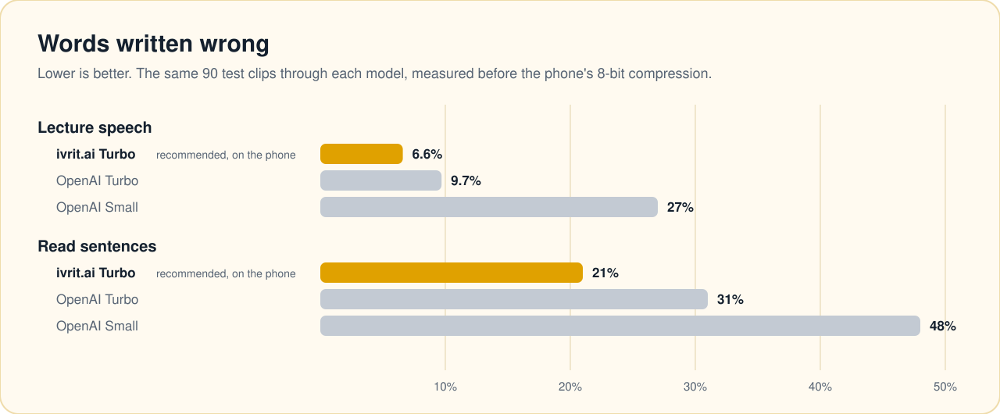
</picture>

### Everything it does

Open a section for the details.

<details>
<summary> <b>Captions</b>: live text that holds still, the speech models, the display</summary>

- **Live captions, not batch transcription.** Partial text updates
  continuously as speech happens; text only locks in (stops changing) once
  it's actually stable — see `CaptionStabilizer`.
- **A Whisper trained on Hebrew, then on the room.** The recommended
  model starts from
  [ivrit.ai's](https://huggingface.co/ivrit-ai/whisper-large-v3-turbo)
  continued training of Whisper large-v3-turbo on about 5,000 hours of
  Hebrew (Apache-2.0). On 90 Hebrew test clips that model got 6.6% of
  words wrong on lecture speech and 21% on read sentences, against 9.7%
  and 31% for OpenAI's Turbo and 27% and 48% for Small, all measured
  before conversion. Ozen then trained its listening half further on
  Hebrew played through real rooms, in household noise and beside a
  talking TV (October 2026). On 700 test sentences heard that way it
  gets 20.1% of words wrong where ivrit.ai's gets 23.1%; on clean speech
  13.3% against 13.1%, and on lectures, read sentences and WhatsApp
  voice notes the two are within half a point (also measured before
  conversion). It is converted to WhisperKit's format and compressed to
  8 bits (819 MB); compressed the same way, ivrit.ai's model wrote the
  same words as the full one on five clips checked on a Mac, but for
  gigahertz run together and one verb form. Nobody publishes these in
  WhisperKit's format, so it is downloaded from the releases of the
  public `ozen-models` repository (`scripts/model-release/`) and compiled
  on the phone.
- **Two swappable on-device engines, plus the cloud** — [WhisperKit](https://github.com/argmaxinc/argmax-oss-swift)
  (Whisper via CoreML) and Apple's own on-device Speech framework — picked
  in Settings, since which one is actually better for Hebrew on a given
  device is an open, testable question rather than an assumption.
- **Whisper model manager**: eleven models from 76 MB to 3 GB with honest
  Hebrew-quality and speed ratings, download progress, disk usage, and
  delete. "Turbo Hebrew, noise-trained (Ozen)" is the recommended pick and
  what a fresh install gets; a phone set up when Small or OpenAI's Turbo
  was the default is offered the switch on the caption screen, one tap
  and one download. One on ivrit.ai's Turbo keeps it until switched in
  the list: the step is real in noise but level up close, too small to
  interrupt the captions for.
- **Display built for reading all evening**: text size 20–64 pt (pinch
  the captions to change it), white-on-black / yellow-on-black /
  black-on-white, or following the phone's own light/dark setting, bold,
  speaker names on/off (shown once at the start of
  each person's turn, like a chat), a small question mark on lines the
  engine itself was unsure of (so she knows when to ask again; with
  ivrit.ai's models one or two lines in a hundred, and in tests 50 of
  52 marked lines had a word wrong; Ozen's noise-trained model is a
  little surer of itself, so its lines get the mark a little sooner: of
  3,500 test lines, near and far, it marked 282 (ivrit.ai's, 297) and
  278 of them had a word wrong), numbers
  (the time of an appointment, how many pills, a phone number) in a
  heavier weight and a second colour, whether written in digits or in
  words ("and six" (u-ve-shesh), "three pills" (shlosha kadurim), "twice"
  (pa'amayim), "once a day" (pa'am be-yom), "in two weeks" (be'od
  shvu'ayim)), long
  stretches of speech
  broken into short paragraphs at sentence ends, screen stays awake while
  listening (and locks as usual after a quarter hour with nothing said, while
  captions and alerts carry on), auto-scroll that stops when you scroll up to re-read (with a
  "To the last line" (la-shura ha-achrona) pill that turns into a count of
  the lines said meanwhile, like "3 new lines"). The screen keeps
  the newest 300 lines; above them a note opens the saved conversation at the
  last line that scrolled away. With VoiceOver on, each finished line is read
  out or sent to a braille display by itself, once (again only if a slow
  engine then corrects its words), with the speaker's name when the
  speaker changes and, on a line with the question mark, "May not have
  been heard correctly" first. Doorbell, alarm and name alerts are
  read out the moment they happen, and so are captions stopping because of
  a problem and coming back after one, saving failing and a microphone
  disconnecting.
- **Keeps its cool.** Whisper refreshes the in-progress line less often
  when the phone runs hot or Low Power Mode is on, instead of throttling
  and falling behind; the careful end-of-sentence pass is never skipped.

</details>

<details>
<summary> <b>Voices and microphones</b>: any microphone, who is speaking, the names to listen for</summary>

- **Explicit microphone selection**, including external Bluetooth/wired/
  USB-C inputs, with automatic recovery when a preferred input reconnects
  mid-conversation.
- **Speaker detection**, always on, with optional voice enrollment so a
  person's turns are labeled by name. Several 30-second recordings of one
  person, made in different places and saved under the same name, work
  better than one long one: on 16 Hebrew speakers in groups of four, three
  short separate recordings named the right person 84% of the time against
  64% for one 30-second recording, and past about a minute of recording,
  length alone stopped helping. Unnamed voices are numbered from
  1 in each conversation, so a phone listening all week doesn't reach
  "speaker 140". Voices are told apart by [WeSpeaker CAM++](https://huggingface.co/Wespeaker/wespeaker-voxceleb-campplus-LM),
  a small (7.3M-parameter) neural speaker-embedding model run entirely
  on-device via CoreML. Lines with no voice in them (a pot put down,
  a running tap) are skipped before Whisper sees them, using
  [Silero VAD](https://github.com/snakers4/silero-vad) in the CoreML
  conversion by [FluidAudio](https://huggingface.co/FluidInference/silero-vad-coreml) (MIT). On a LibriSpeech clustering test it separates a
  simulated four-person table correctly 96.8% of the time, against 45.8%
  for the classic MFCC print it replaced. A conversation is harder: on 18
  put together from 16 Hebrew speakers' recordings, two to four people
  each, the app's own speaker code labelled who said a sentence right 79%
  of the time up close and 64% from across a room, and up close it showed
  more voices than there were (two people came out as three to six).
- **Saved speakers can be renamed**, and the new name follows onto lines
  already on screen, into the names list and into every saved
  conversation, so fixing a misspelled name also fixes last week's
  conversations and a search for the new name finds them.
- **Names and words list.** Family names, the doctor, the medicines.
  Every engine is primed with the list (Apple's recognizer via
  contextual strings, Whisper via a decoder prompt, the home computer and
  each cloud service in its own way; on a long list,
  Whisper on the phone gets only the start of it, about 20 first names or
  a dozen full names and medicines, so put the important ones
  first), edits apply from the next sentence, and Whisper output that is
  just the list read back is dropped.
- **Robust audio**: a live level meter per microphone, automatic recovery
  from phone-call interruptions and route changes (AirPods in/out, USB mic
  unplugged), Whisper-hallucination filtering on silence, no model runs on
  pure silence at all. A glitching microphone's broken samples are turned
  into silence before anything hears them, so one bad moment can't leave
  the speech detector deaf or a voice print unmatchable, and the
  diagnostics report counts them.

</details>

<details>
<summary> <b>Alerts</b>: her name, the doorbell, a smoke alarm, the battery</summary>

- **Keyword alerts.** Her name, or any word she picks, buzzes the phone
  and highlights the line, matching through Hebrew's attached prefixes
  ("ve-le-Ruti" still matches "Ruti"), without firing a short name on the
  everyday word it hides in ("Li" stays quiet on "sheli", mine; "Ben" on
  "lavan", white; "Sarah" on "kshera", kosher; "Leah" on "mele'ah", full),
  nor on a word still being said ("Tal" stays quiet on "ha-tel..." until it
  turns out to be "ha-telefon", the phone). The suggested "medicine" and "doctor" also match
  "the medicines" and a woman doctor. Said over and over at the table, it
  buzzes at most once every 15 seconds, while every line it's in stays
  highlighted.
- **Sound alerts.** Doorbell, knocking, a baby crying, a smoke alarm, a
  civil-defence siren and about 45 more, recognized on the phone by
  Apple's sound classifier and shown as a banner, with per-sound muting.
  Sirens and alarms flash the edge of the whole screen for a few seconds,
  the doorbell and a crying baby twice, so they're caught from the corner
  of the eye (slower than any seizure risk, and a steady glow with Reduce
  Motion on). The phone vibrates differently for each, so they can be told
  apart in a pocket: long buzzes for an alarm, a double knock for the door,
  three quick taps for her name. The banner and flash also show over
  whatever screen is open, such as the keyboard for typing a reply. A
  lesser sound heard meanwhile (a kettle during a smoke alarm) still buzzes
  but doesn't take the alarm's banner or flash away. While captions wait to
  try again (the home computer asleep, the cloud out of reach, a model
  download being retried or waiting for Wi-Fi or for room on the phone)
  the microphone stays on for sound alerts alone,
  so a smoke alarm at night isn't missed because the computer was off.
- **Alerts reach her with the screen off.** With the phone in a pocket or
  locked, a sound alert or her name becomes a phone notification (once per
  30 seconds per sound or word), so the doorbell isn't missed just because
  nobody was looking at the app. If captions stop there and nothing will
  bring them back (a call ends but iOS keeps the microphone, or recovery
  gave up), the app first tries to take the microphone back by itself, and
  otherwise sends one notification saying so, removed again once captions
  are back. (iOS may suspend a locked app for the length of a call; then
  this runs whenever iOS next lets the app run.) The same notification
  says when the home computer stops answering, since waking it is what
  brings captions back.
- **Battery warnings** at 20% and 10% while captions run, because hours of
  listening drain the phone and nobody following a conversation watches
  the battery icon. With the phone in a pocket they arrive as a
  notification, since a phone that switches off takes the alerts with it.
  They also come while captions wait to come back with the microphone on
  for sound alerts.

</details>

<details>
<summary> <b>Lock screen and coming back</b>: the lock screen, what she missed, nothing lost</summary>

- **Captions on the lock screen.** While captions run, the newest two
  lines show on the lock screen as a Live Activity (the Dynamic Island
  shows the newest one when it is opened), each saying who is talking when
  speaker names are on and the voice is known, so the last sentence can
  be read without unlocking the phone. A call or a failure keeps it there
  and says why the lines stopped; if iOS closes the app it says the lines
  aren't updating rather than showing an old sentence as new, and after a
  quiet minute it says how long ago the last line was said. A line from
  before five quiet minutes never sits above a new one. Settings can
  turn it off, since anyone looking at the phone can read it.
- **Picks up where she stopped reading.** Captions carry on with the phone
  locked or another app open; coming back, a line across the captions marks
  where the ones she missed begin, with how many there are, and a button at
  the top jumps up to it ("What was said meanwhile" (ma she-ne'emar
  beinta'yim)). Being away less than 15 seconds, or missing a single line,
  doesn't move the mark.
  After five minutes or more with nothing said, the time the talking
  started again is drawn between the lines, so an old sentence isn't read
  as the one just before.
- **Bottom buttons that get out of the way**: while captions follow the
  newest line on their own, the buttons slide away after a few seconds so
  they never cover it; a touch brings them back.
- **Nothing lost when iOS closes the app.** A speech model is one of the
  biggest things in a phone's memory, so iOS may end the app in the
  background mid-conversation. Coming back, the empty screen offers the
  conversation if it was still going in the last 20 minutes, one tap
  away. When iOS warns it is short of memory and captions are off, the
  app lets go of the loaded model first, so it is less likely to be the
  app iOS ends.

</details>

<details>
<summary> <b>Talking back</b>: typed replies said aloud or shown huge, Siri, Control Center</summary>

- **Type to speak.** The other half of a conversation: type a reply, or
  tap one of the ready-made phrases ("Wait, I didn't catch that" (rega, lo
  hevanti), "Could you say that again?" (efshar lachzor al ze?), "Please speak
  closer to the phone" (dabru karov yoter la-telefon), which helps the
  captions most), and the phone
  says it aloud, in the voice of the language it is written in (Hebrew
  letters get a Hebrew voice). The last typed sentence stays under the field, to say
  again when it wasn't caught or keep as a ready-made phrase in one tap.
  Captions pause while the phone
  talks, so it doesn't caption itself, and come back on their own. A
  full-screen pad in huge letters lets someone type to her where captions
  can't keep up, or turns what she typed upside down for the person facing
  her to read. Siri opens it straight away with "kitvu li be-Ozen" ("write to me in Ozen") in Hebrew or "Big text in Ozen" in English, and so can the Action button.
- **Siri and Shortcuts.** "Hey Siri, start captions in Ozen" (hey Siri,
  hatchel ktuviyot be-Ozen), "Stop captions" (atzor ktuviyot),
  and, to have the phone say something aloud, "tagid be-Ozen" in Hebrew or "Say with Ozen" in English; Siri then asks what to say.
  Each also in the feminine (hatchili, itzri, tagidi).
- **A start button in Control Center** (iOS 18): "Start captions" (hatchalat
  ktuviyot) opens Ozen and starts listening in one press. It can also
  replace the flashlight or camera button at the bottom of the lock screen.

</details>

<details>
<summary> <b>History</b>: saved, searchable conversations and starred lines</summary>

- **Conversation history.** Conversations are saved as they happen,
  searchable (every word typed has to be in the conversation, in any order
  and on any line, and opening a result jumps to where they were said),
  shareable as text (a long one opens with its lines that had
  numbers in them, and a line with the question mark says "May not have
  been heard correctly"), can be given a name ("Visit to the doctor" (bikur etzel
  harofe)), list who took part, and open with a summary: length, how much
  each person said, speaking pace, longest turn, and every line with a
  time, an amount or a phone number in it, each a tap from where it was
  said. Phone numbers in captions, including the 1-700 and 1-800 numbers
  health funds and pharmacies give out, are a tap from a call (star
  numbers such as *2700 stay text: iOS won't dial them from a link). A
  number is only linked when it has the right length for its prefix, so
  a date, an hour or a digit said next to it is never dialed with it.
  Holding a line copies just that line, to paste a phone number or
  an address somewhere else.
  The list is grouped under "Today" (hayom), "Yesterday" (etmol), the
  weekday for the past week, and the date before that.
  The list reads a small summary per conversation, so it opens quickly
  even after months of daily use, and autosaving never stutters the
  captions. Old conversations can delete themselves after a week, a
  month, three months or a year (off by default); starred or named ones
  are always kept, and a change that would delete something asks first.
  If the phone fills up and saving starts failing, the caption screen says
  so, instead of conversations quietly going unsaved.
- **Star what matters.** Hold a caption line to mark it as important
  (what the doctor said about the pills), copy it, or say who is talking.
  Stars are saved with the conversation, counted in the history list,
  marked in shared text, and one button steps through them later. One
  list gathers every starred line from every conversation, with the
  question mark on any the engine was unsure of, and can be shared as
  text. A search result opens at the lines it found,
  highlighted.

</details>

<details>
<summary> <b>Privacy, the home computer and the cloud</b>: what leaves the phone, and only when you choose</summary>

- **Nothing leaves the phone unless you choose to send it.** No account,
  no company server. The exceptions are all explicit and off by default:
  your own home computer, cloud captions above, and a switch to let
  Apple's recognizer use Apple's servers when iOS has no on-device Hebrew
  model. Saved conversations and settings (names, voice prints) are part
  of the phone's own iCloud or computer backup when that is on, like any
  app's; the sound clips, the diagnostics journal and the models are kept
  out of it.
- **Your own computer as the recognizer (optional).** A Windows or Linux
  PC with an NVIDIA graphics card, at home, writes the captions instead
  of the phone: the phone sends its microphone to the PC and gets the
  words back, on the home Wi‑Fi or from anywhere with internet (through
  an encrypted `wss://` address). The PC runs the full-size Hebrew Whisper (ivrit.ai's large-v3,
  1.55 billion parameters, 16-bit) with beam search for each finished
  sentence, and the faster Turbo for the live words: 8.3% of words wrong
  on Hebrew conversation, against 8.9% for the phone's model, and 22%
  against 25% when the speaker sits across the room. Words appear about
  0.2 s after they are said; a finished sentence settles about 0.9 s after
  the speaker stops (on an RTX 2080 Ti). Setup is one double-click
  (`Ozen-Home-Setup.cmd` from the latest release) and pairing is a QR
  code; if the PC can't be reached, the phone's own model carries on,
  once it has been downloaded as a backup (Settings → Home computer →
  "Download a backup to the phone"; without it captions wait for the PC,
  start again within about 15 seconds of it answering, and the status line
  offers the backup; sound alerts keep listening meanwhile).
  See [Home computer requirements](#home-computer-requirements) and
  `server/README.md`.
- **Optional cloud captions** for when the phone's models are too slow or
  lose track of several people talking: what is said goes to the cloud
  speech service chosen in Settings, [Soniox](https://soniox.com) (which
  writes the words as they are said, over one open connection),
  [Deepgram](https://deepgram.com), [OpenAI](https://openai.com),
  [Groq](https://groq.com), [ElevenLabs](https://elevenlabs.io),
  [Google Gemini](https://ai.google.dev),
  [Speechmatics](https://www.speechmatics.com),
  [AssemblyAI](https://www.assemblyai.com) (both also write as the words
  are said), or a Google model through
  [OpenRouter](https://openrouter.ai), with your own
  key pasted into Settings (stored only in the phone's Keychain, one per
  service), together with the names and important words lists so it can
  spell them. Which one? Soniox: the most accurate of the cloud services on
  ivrit.ai's public Hebrew leaderboard, and the cheapest, about 12 cents for
  every hour the captions run. To try the cloud for free, Deepgram: second
  best on that test, and a new account gets $200 of free credit with no
  card. Prices, languages, privacy and how to get each key:
  [docs/cloud-services.md](docs/cloud-services.md).
  Through OpenRouter, on twelve Hebrew test
  recordings its more accurate Gemini model got 24% of words wrong (the
  faster, cheaper one 29%) against 39% for OpenAI's Whisper large-v3 turbo
  and 60% for Whisper small, and puts each change of speaker on its own line. The
  phone's Hebrew-trained model was not in that test; on 60 other read
  recordings it made a third fewer mistakes than OpenAI's turbo (21%
  against 31%), so the cloud is no longer clearly the more accurate
  choice. Except on the services that keep one connection open
  (Soniox, Speechmatics, AssemblyAI), a sentence is sent again every few
  seconds while it is said; through OpenRouter the faster model costs about
  15 cents per hour of speech, the more accurate about twice that, and
  unbroken talk like the news up to three times as much; off Wi-Fi that is a
  few hundred MB of mobile data an hour, up to about 1 GB. See `CloudSpeech`
  and `CloudStreamEngine`. If the key
  stops working, the credit runs out or the internet goes, a Whisper
  model already on the phone takes over and the status line says so
  (`CloudCover`); captions don't stop for a billing problem.

</details>

<details>
<summary> <b>Reliability</b>: recovery, downloads, the status line, the seven-day install</summary>

- **Recovers by itself.** A recognizer that drops out mid-conversation,
  an audio session that fails, or a model download that hit a dead Wi-Fi
  is retried automatically with growing delays, and the status line says
  so. Failures only a person can fix (a denied permission) never are.
  Retries wait out a phone call instead of burning attempts during it.
  A microphone that silently stops delivering audio (a Bluetooth hearing
  aid reconnecting, say) is noticed within seconds and restarted, instead
  of the screen saying "listening" over captions that never come.
- **A status control that always says what's happening** — asking for the
  microphone, downloading the model (with a percentage and the time left
  at its current pace), loading it,
  listening, paused, or exactly what failed and what to do about it
  (retry, open Settings, switch engine). First-launch model download is the
  slowest thing the app ever does and is never silent.
- **Downloads that can't get stuck.** A cut-off model download is told
  apart from a whole model and simply continues from where it stopped,
  instead of failing to load on every launch.
- **Downloads that don't eat the data plan.** On cellular or in Low Data
  Mode a model waits for Wi-Fi, says how big it is, and starts by itself
  when Wi-Fi arrives. "Download now" asks first; a setting allows it
  always.
- **Downloads that fit.** Free space is checked before a model download
  starts, with room left for the first load. A phone that's too full says
  how much to free (or to pick a smaller model), is never retried on a
  timer, and starts the download by itself when she comes back to the app
  with enough room. The model list marks the models that won't fit, and
  they can't be picked over the one that works. Switching to a model that
  still has to download while captions run asks first, since captions
  stop until it arrives.
- **Warns before the install runs out.** Installed with a free Apple ID,
  the app stops opening after seven days without a word. It reads its own
  provisioning profile, says on the caption screen two days ahead when that
  will happen ("Ozen will stop opening tomorrow at 07:24" (Ozen tafsik
  lehipatach machar be-sha'a 07:24)), and sends a reminder
  notification the day before, in daytime.

</details>

<details>
<summary> <b>Setup and help</b>: the first launch, twelve languages, diagnostics</summary>

- **First-launch walkthrough** in large type that explains the engines and
  the one-time model download before it happens, asks for the
  microphone with a reason, and asks for her name (with "Grandma" (savta) one tap
  away), so the name alert works from the first conversation instead of
  waiting for someone to find it in Settings. A phone set up before that
  page existed gets the same question as a card on the empty caption
  screen, until a word is added or it's turned down.
- **Twelve interface languages** (Hebrew, English, Arabic, Russian,
  Amharic, French, Spanish, Ukrainian, German, Portuguese, Simplified
  Chinese, Hindi), following the phone's language or a choice in Settings.
  Every piece of text is written as `tr(hebrew, english)`, with every other
  language drawn from a translation table keyed by the English text
  (`scripts/check-translations.py` checks both); Hebrew and Arabic read
  right to left, and caption lines stay right to left for Hebrew speech
  either way.
- **Diagnostics screen** with every pipeline counter (audio chunks, tokens,
  caption lag, restarts, speaker clusters), free space, memory use, a
  timeline of the last failures, retries, microphone stalls, phone calls
  and low-memory warnings with clock times, and one-tap copy of all of it
  for asking for help.

</details>

## Training a model that hears across the room

<picture>
  <source media="(prefers-color-scheme: dark)" srcset="docs/assets/training-dark.svg">
  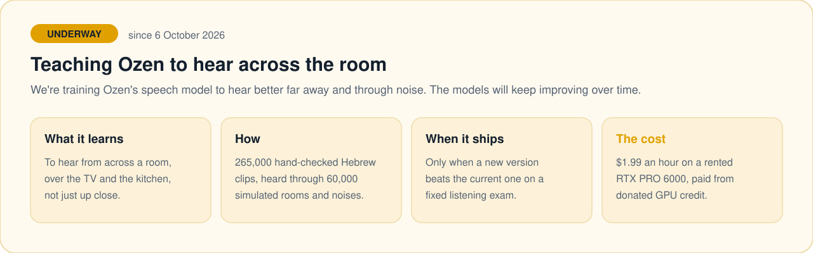
</picture>

Ozen's own version of the speech model, trained to hear better from
across a room and through household noise, shipped on 9 October 2026 and
is the recommended model: on 700 test sentences heard across a room, in
household noise or beside a TV it gets 20.1% of words wrong, against 23.1%
for ivrit.ai's Turbo it was trained from, and clean speech is level (13.3%
against 13.1%). The models will keep improving over time. Each new version
sits the same fixed listening exam and replaces the current one only when
it does better. Training ran on a rented RTX PRO 6000 at $1.99 an hour,
paid from free GPU credit GarageFarm gave the project. The scripts are in
`training/`.

## Home computer requirements

Only for the optional home computer; the phone works on its own.

| | Minimum | Recommended |
|---|---|---|
| Graphics card | NVIDIA GTX 16-series or RTX 20-series or newer, 6 GB (e.g. RTX 2060) | NVIDIA with 8 GB or more (e.g. RTX 3060 12 GB, 4060, 2080 Ti) |
| What runs | The fast Turbo model for everything | Turbo for live words plus the full large-v3 for finished sentences (more accurate, most of all from across the room) |
| Disk | 7 GB free | 12 GB free |
| System | Windows 10/11 or Linux, with the normal NVIDIA driver | same |
| Connection | The phone reaches it on the same Wi‑Fi, or from anywhere through the free Tailscale Funnel the setup offers | same |

Older NVIDIA cards (GTX 10-series and earlier) have enough memory but lack
the fast 16-bit arithmetic the server uses, and AMD, Intel and Apple
graphics aren't supported. Memory in use is about 6.5 GB with both
models: 1.6 GB for Turbo and 3.1 GB for large-v3 at 16 bits, the rest the
work space of five-way beam search over 30-second windows and NVIDIA's
libraries. The Windows setup checks the card and the free space before
it downloads anything, and adds the full model on a card with 8 GB or
more. On Linux `server/setup.sh` checks neither, and the full model is
added by hand (see `server/README.md`).

Measured on rented cards (2026-09-27, the server's exact work on the same
100 Hebrew sentences: the full model with beam 5 for each finished
sentence, Turbo for live words; every card wrote the same text):

<picture>
  <source media="(prefers-color-scheme: dark)" srcset="docs/assets/home-speed-dark.svg">
  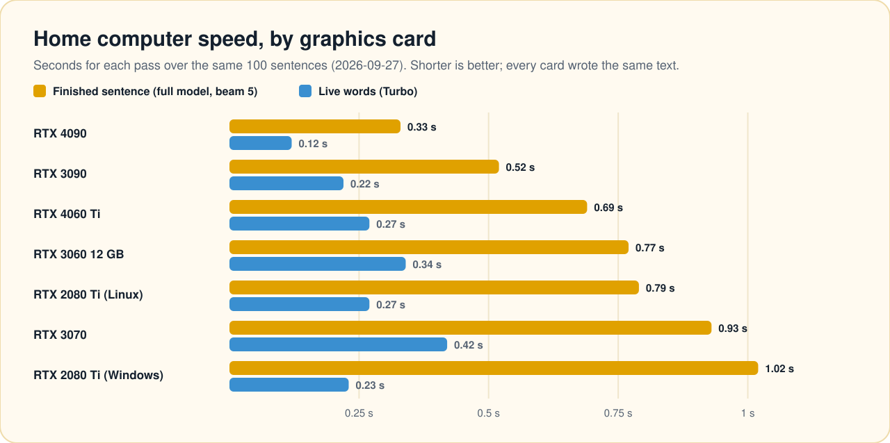
</picture>

<details>
<summary>The same numbers as a table</summary>

| Card | Finished sentence | Live words |
|---|---|---|
| RTX 4090 | 0.33 s | 0.12 s |
| RTX 3090 | 0.52 s | 0.22 s |
| RTX 4060 Ti | 0.69 s | 0.27 s |
| RTX 3060 12 GB | 0.77 s | 0.34 s |
| RTX 2080 Ti (Linux) | 0.79 s | 0.27 s |
| RTX 3070 | 0.93 s | 0.42 s |
| RTX 2080 Ti (Windows) | 1.02 s | 0.23 s |

</details>

The two 2080 Ti rows are different computers, so the gap between them is a
hint that Windows adds overhead to beam search, not a clean measurement.

A faster card shortens only the final pass: words already appear about
0.2 s after they're said, and a sentence counts as finished after a 0.7 s
pause whatever the card. Beam search wider than 5 measured no more
accurate (beam 20: same 8.3% word error, 1.5 s per sentence instead of
0.9 s); Settings → Home computer → "Speed or accuracy" trades a little
accuracy for about 0.15 s at beam 1.

## Repo layout

```
Package.swift          OzenKit: platform-independent core logic
Sources/OzenKit/        (builds + tests on Linux — no Mac needed for this half)
Sources/OzenPlatform/  WhisperKit/Speech/AVFoundation/Accelerate integration
                        (Apple-only; built and tested via CI's macOS runner)
Tests/                  Unit tests for both of the above
App/Ozen/               The SwiftUI app itself (generated via XcodeGen)
App/OzenWidget/         Widget extension: lock screen captions, Control Center button
App/Shared/             Code compiled into both the app and the widget extension
project.yml             XcodeGen config — run `xcodegen generate` to get Ozen.xcodeproj
docs/superpowers/specs/ Design doc with the full rationale and open questions
training/               Training the speech model to hear across a room, and its exam
```

## Building

This was developed without access to a Mac. The portable core is built and
tested directly:

```bash
swift build && swift test
```

The full app (anything touching WhisperKit/Speech/AVFoundation/SwiftUI)
only builds on iOS — `AVAudioSession` in particular doesn't exist on macOS
at all, so this half is built and tested by CI
(`.github/workflows/ci.yml`) against the iOS Simulator on GitHub's free
macOS runners, not a plain macOS build. To build it yourself on a Mac:

```bash
brew install xcodegen
xcodegen generate
xcodebuild -project Ozen.xcodeproj -scheme Ozen -destination "platform=iOS Simulator,name=iPhone 16" test
```

## Installing on a phone without a Mac

`.github/workflows/release.yml` builds an unsigned `Ozen.ipa` on GitHub's
macOS runners and attaches it to a release. Signing and installing it with
a free Apple ID from a Linux machine is documented step by step, including
the three things that were broken along the way, in
[docs/sideloading-from-linux.md](docs/sideloading-from-linux.md).

**On iOS or iPadOS 26 and later, install with
[Impactor](https://github.com/claration/Impactor), not AltServer.** A build
signed by AltServer-Linux installs without an error but never opens: the
system rejects its signature before the app starts (`AMFI: code signature
validation failed` in the device log), so it looks like the app crashes on
launch and leaves no crash report. Confirmed on iPadOS 27 on 2026-09-27.

When she calls with a problem, [docs/troubleshooting.md](docs/troubleshooting.md)
says what every status message means and what to do about it, and how to
get the diagnostics report sent over.

## Status

The whole pipeline — permission, session, input listing, engine
preparation with progress, capture, tokens → segments, speaker clustering,
engine hot-swap, pause/resume, automatic recovery, every failure path —
lives in `OzenKit` as `CaptionPipeline` and is unit tested on Linux
against fakes, along with the alert matching, history, statistics,
vocabulary, model-download, recovery, battery, notification and layout
logic (over 1,200 tests). The platform layer (WhisperKit/Speech engines, real
audio capture, the speaker embedder) and the app's view model are built
and tested on CI's iOS Simulator, with the view model driven end to end by
the same fakes (about 180 more; the Simulator run, which repeats the
portable ones, has about 1,400).
The app has been installed and run on a real iPhone 15 Pro Max (iOS 18)
and an iPad (iPadOS 27). Actual Hebrew
transcription quality, external-mic behaviour and speaker separation in a
real room are being verified by hand — see the design doc's [checklist](docs/superpowers/specs/2026-09-13-ozen-live-captions-design.md#testing-strategy).
Ozen's own version of the speech model, trained to hear across a noisy
room, has been the recommended model since 9 October 2026; see
[Training](#training-a-model-that-hears-across-the-room).

## Support Ozen

Ozen is free and will stay free, with no ads and nothing locked. Donating is
entirely optional: please never feel obligated, and only donate if you are in
a financial position where you can comfortably afford it. Using Ozen and
telling others about it already helps a lot.

How to donate:

1. Open your crypto wallet app and choose Send.
2. Pick the same coin as listed here. A coin sent to another coin's address is lost.
3. Scan the QR code with the wallet, or copy the address and paste it.
4. Before sending, check that the first and last few characters of the address match.

<table>
  <tr>
    <td align="center" valign="top" width="33%"><br><b>Bitcoin (BTC)</b></td>
    <td align="center" valign="top" width="33%"><br><b>Ethereum (ETH)</b><br><sub>plus USDC and USDT on the Ethereum network only</sub></td>
    <td align="center" valign="top" width="33%"><br><b>Monero (XMR)</b></td>
  </tr>
</table>

Bitcoin (BTC)

```
bc1qk5aym0mch042200s2wrc366r3hsxxmgc9nu7tm
```

Ethereum (ETH, plus USDC and USDT on the Ethereum network only)

```
0x0Ea2210fcB0BbF2C3202d9663dB762F1f51b1BBC
```

Monero (XMR)

```
46otohcpNKQfFi9F21ZHTcSiNVrLMw4yMS1SFM5hbDfu5LZCzLGkEZ2Vx4YD5kwK3nKUG6GjMf37z7i6sFQR2NEC1W9ubhb
```

The same addresses and codes are in the app under Settings, About, Support Ozen.

## Supporters

These companies gave or offered Ozen free plans or credits. Thank you.

- AI code reviews provided by [CodeAnt](https://codeant.ai)
- Security scanning by [Snyk](https://snyk.io)
- Audio processing support from [LALAL.AI](https://www.lalal.ai)
- GPU training credits provided by [GarageFarm.NET](https://www.garagefarm.net)
- Voice AI credits from [Retell AI](https://www.retellai.com)
- Audio processing support from [Auphonic](https://auphonic.com)
- Database tooling support from [Prisma](https://www.prisma.io) (credit offered)
- GraphQL engine support from [Hasura](https://hasura.io) (credit offered)

## License

GNU Affero General Public License v3.0 — see [LICENSE](LICENSE).

Ozen is free software, and every copy has to stay free: anyone who shares
the app, a changed version of it, or runs a changed home-computer server for
other people must pass on the full source code under the same license. Code
taken from an earlier version before 2026-09-28 was under MIT; everything from
then on is AGPL-3.0.

<p align="center">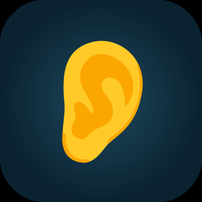<br>Made by Arbel.</p>
